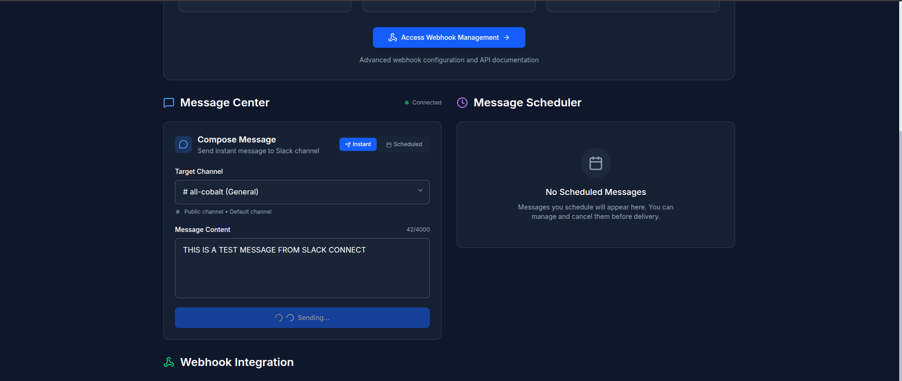
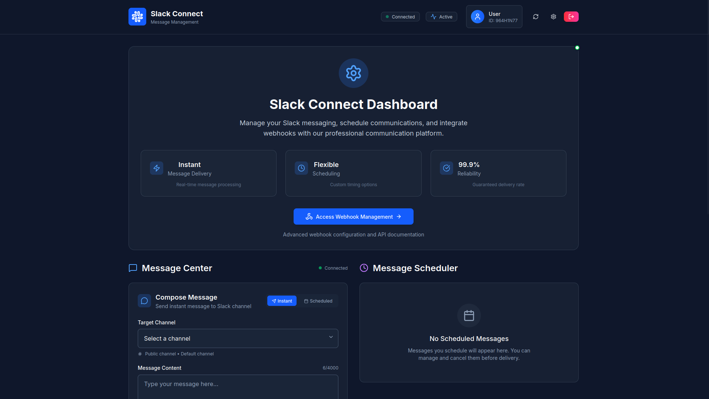

# 🚀 Complete Deployment Guide for Slack Connect


*Professional Slack Connect Platform ready for deployment*

## 📋 **Pre-Deployment Checklist**

### 1. **Create Your Slack App** (Required)
Go to [Slack API Apps](https://api.slack.com/apps) and create a new app:

```
App Name: [Your App Name] (e.g., "My Slack Connect")
Development Slack Workspace: [Your workspace]
```

**Get these credentials:**
- `Client ID` (from Basic Information)
- `Client Secret` (from Basic Information)
- Create a webhook URL (from Incoming Webhooks)

### 2. **Configure Slack App Settings**

#### OAuth & Permissions:
```
Redirect URLs: https://your-backend-name.onrender.com/api/auth/callback
Bot Token Scopes:
- channels:read
- chat:write
- chat:write.public
- incoming-webhook
```

#### Incoming Webhooks:
- Activate Incoming Webhooks: ON
- Add New Webhook to Workspace
- Copy the webhook URL

---

## 🎯 **Step-by-Step Deployment**

### **Preview of Your Final Application**

After successful deployment, your users will experience:

#### Landing Page

*Clean, professional landing page that users will see first*

#### Workspace Configuration

*Intuitive workspace configuration interface*

#### Message Scheduling

*Advanced message scheduling with date/time picker*

#### Message Testing

*Professional testing interface for validation*

### **Step 1: Update Backend Environment Variables**

Before deploying, update your `.env` file with your credentials:

```env
# Slack OAuth Configuration
SLACK_CLIENT_ID=your_actual_client_id_from_slack_app
SLACK_CLIENT_SECRET=your_actual_client_secret_from_slack_app
SLACK_REDIRECT_URI=https://your-backend-name.onrender.com/api/auth/callback

# Slack Webhook Configuration  
SLACK_WEBHOOK_URL=your_actual_webhook_url_from_slack_app

# Frontend Configuration
FRONTEND_URL=https://your-frontend-name.netlify.app

# JWT Configuration (Generate a secure 32+ character secret)
JWT_SECRET=your_super_secure_jwt_secret_minimum_32_characters_long

# CORS Configuration
CORS_ORIGIN=https://your-frontend-name.netlify.app
```

### **Step 2: Deploy Backend to Render**

1. **Create Render Account:** Go to [render.com](https://render.com)

2. **Connect Repository:** 
   - New > Web Service
   - Connect your GitHub repository
   - Select the backend folder: `SlackConnectBackendV1`

3. **Configure Render Settings:**
   ```
   Name: your-backend-name (e.g., my-slack-connect-backend)
   Environment: Node
   Region: Choose closest to your users
   Branch: main
   Root Directory: SlackConnectBackendV1
   Build Command: npm install
   Start Command: npm start
   ```

4. **Add Environment Variables in Render:**
   Copy all variables from your `.env` file to Render's Environment Variables section

5. **Deploy:** Click "Create Web Service"

### **Step 3: Deploy Frontend to Netlify**

1. **Update Frontend Environment:**
   Create/update `SlackConnectFrontendV1/.env.local`:
   ```env
   NEXT_PUBLIC_BACKEND_URL=https://your-backend-name.onrender.com/api
   ```

2. **Deploy to Netlify:**
   - Go to [netlify.com](https://netlify.com)
   - New site from Git
   - Connect your repository
   - Configure:
     ```
     Base directory: SlackConnectFrontendV1
     Build command: npm run build
     Publish directory: out
     ```

3. **Add Environment Variables in Netlify:**
   ```env
   NEXT_PUBLIC_BACKEND_URL=https://your-backend-name.onrender.com/api
   ```

### **Step 4: Update Slack App Configuration**

After both deployments, update your Slack app:

1. **OAuth & Permissions > Redirect URLs:**
   ```
   https://your-actual-backend-name.onrender.com/api/auth/callback
   ```

2. **Verify webhook URL is correctly set in your app**

---

## 🔐 **Security Credentials You Need to Change**

### **Required Changes:**
1. **SLACK_CLIENT_ID**: Get from your Slack app
2. **SLACK_CLIENT_SECRET**: Get from your Slack app  
3. **SLACK_WEBHOOK_URL**: Create in your Slack app
4. **JWT_SECRET**: Generate a secure 32+ character string
5. **Domain URLs**: Update to your actual deployment URLs

### **Generate Secure JWT Secret:**
```bash
# Use one of these methods:
node -e "console.log(require('crypto').randomBytes(32).toString('hex'))"
# Or
openssl rand -hex 32
```

---

## ✅ **Final Testing Checklist**

After deployment, test your application functionality:

### 1. **Backend Health Check:**
- Visit: `https://your-backend-name.onrender.com/health`
- Should return: `{"status": "ok"}`

### 2. **Frontend Access:**

- Visit: `https://your-frontend-name.netlify.app`
- Should load the professional landing page shown above

### 3. **Workspace Configuration:**

- Test the workspace ID input functionality
- Verify proper validation and feedback

### 4. **OAuth Flow:**
- Click "Connect to Slack"
- Should redirect to Slack for authorization
- Should redirect back successfully

### 5. **Message Scheduling:**

- Test the scheduling interface
- Verify date/time picker functionality
- Confirm channel selection works

### 6. **Message Testing:**

- Use the testing interface to validate functionality
- Send test messages to verify Slack integration
- Check that messages appear in your Slack channel

---

## 🚨 **Common Issues & Solutions**

### **CORS Errors:**
- Ensure `CORS_ORIGIN` matches your frontend URL exactly
- No trailing slashes in URLs

### **OAuth Errors:**
- Verify redirect URI in Slack app matches backend URL exactly
- Check Slack app has correct bot scopes

### **Build Errors:**
- Ensure all environment variables are set in Render/Netlify
- Check build logs for missing dependencies

### **Interface Issues:**
If your interface doesn't match the screenshots:
- Clear browser cache and reload
- Check that all CSS/JS files are loading properly
- Verify environment variables are correctly set

---

## 🎉 **Deployment Success**

Congratulations! Your Slack Connect application is now live and ready for use.

### **Your Application Features:**

#### ✅ Professional Landing Page

*Clean, professional interface ready for users*

#### ✅ Workspace Management  

*Intuitive workspace configuration*

#### ✅ Advanced Scheduling

*Comprehensive message scheduling capabilities*

#### ✅ Testing & Validation

*Professional testing interface for reliability*

### **Final URLs:**
- **Frontend**: `https://your-frontend-name.netlify.app`
- **Backend**: `https://your-backend-name.onrender.com`
- **Health Check**: `https://your-backend-name.onrender.com/health`

---

## 📞 **Support**

If you encounter issues:
1. Check Render/Netlify deployment logs
2. Verify all environment variables are set correctly
3. Test Slack app configuration independently
4. Compare your interface with the screenshots above

**Your professional Slack Connect platform is now ready for use! 🎉**

---

*The application shown in the screenshots above represents your fully deployed, professional-grade Slack integration platform.*
